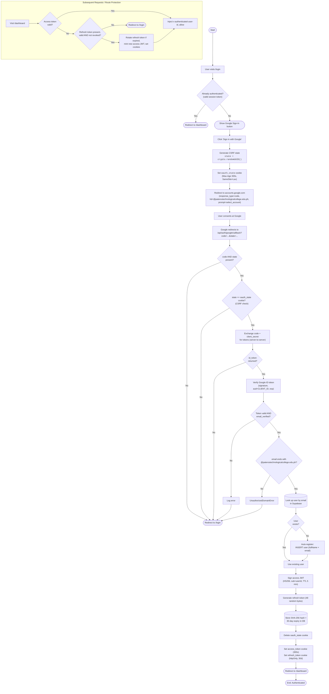

# Login Flowchart

```mermaid
flowchart TD
    START(["Start"]) --> A["User visits /login"]
    A --> B{"Already authenticated?<br/>(valid session token)"}
    B -->|"Yes"| R1(["Redirect to /dashboard"])
    B -->|"No"| D(["Show Google Sign-In button"])

    D --> E["Click 'Sign in with Google'"]
    E --> F["Generate CSRF state<br/><code>state = crypto.randomUUID()</code>"]
    F --> G["Set <code>oauth_state</code> cookie<br/>(Max-Age 300s, SameSite=Lax)"]
    G --> H["Redirect to accounts.google.com<br/>(response_type=code, hd=@paterostechnologicalcollege.edu.ph, prompt=select_account)"]

    H --> I["User consents at Google"]
    I --> J["Google redirects to<br/>/api/auth/google/callback?code=...&state=..."]

    J --> K{"code AND state<br/>present?"}
    K -->|"No"| L(["Redirect to /login"])
    K -->|"Yes"| M{"state == oauth_state cookie?<br/>(CSRF check)"}
    M -->|"No"| L
    M -->|"Yes"| N["Exchange code + client_secret<br/>for tokens (server-to-server)"]

    N --> O{"id_token<br/>returned?"}
    O -->|"No"| L
    O -->|"Yes"| P["Verify Google ID token<br/>(signature, aud=CLIENT_ID, exp)"]

    P --> Q{"Token valid AND<br/>email_verified?"}
    Q -->|"No"| E1["Log error"] --> L
    Q -->|"Yes"| S{"email ends with<br/>@paterostechnologicalcollege.edu.ph?"}
    S -->|"No"| T["UnauthorizedDomainError"] --> L
    S -->|"Yes"| U[("Look up user by email<br/>in Supabase")]

    U --> V{"User<br/>exists?"}
    V -->|"No"| W["Auto-register:<br/>INSERT user (fullName + email)"]
    V -->|"Yes"| X["Use existing user"]
    W --> X

    X --> Y["Sign access JWT<br/>(HS256, sub=userId, TTL 5 min)"]
    Y --> Z["Generate refresh token (48 random bytes)"]
    Z --> Z2[("Store SHA-256 hash +<br/>30-day expiry in DB")]
    Z2 --> AA["Delete oauth_state cookie"]
    AA --> AB["Set access_token cookie (300s)<br/>Set refresh_token cookie (httpOnly, 30d)"]
    AB --> AC(["Redirect to /dashboard"])
    AC --> END2(["End: Authenticated"])

    subgraph GUARD[Subsequent Requests / Route Protection]
        AD["Visit /dashboard"] --> AE{"Access token<br/>valid?"}
        AE -->|"Yes"| AF["Inject x-authenticated-user-id, allow"]
        AE -->|"No"| AG{"Refresh token present,<br/>valid AND not revoked?"}
        AG -->|"No"| AH(["Redirect to /login"])
        AG -->|"Yes"| AI["Rotate refresh token if expired,<br/>mint new access JWT, set cookies"]
        AI --> AF
    end
```